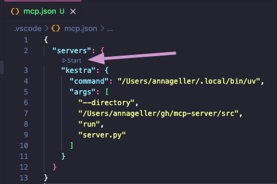
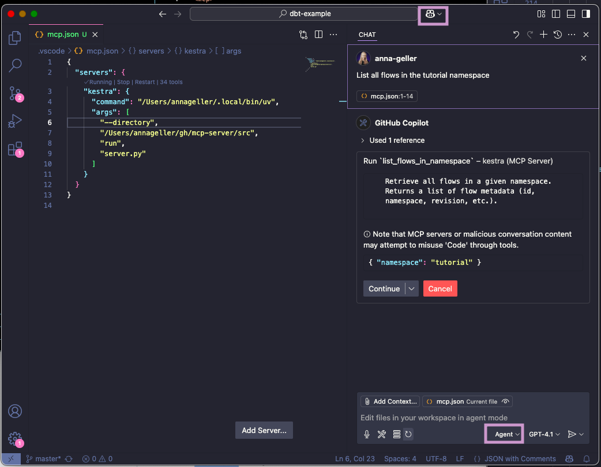
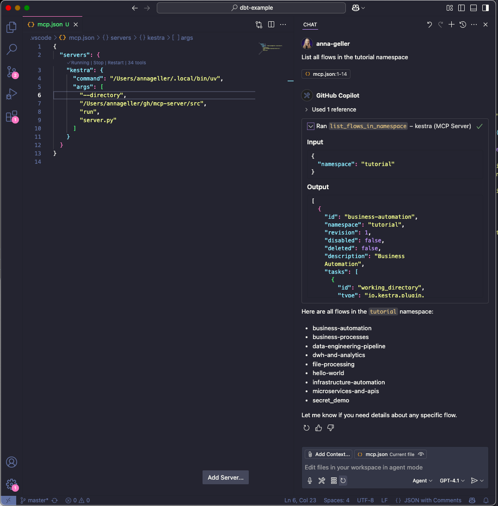
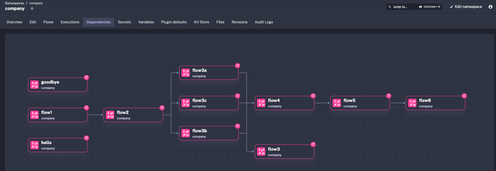

## Kestra Python MCP Server

> **⚠️ Beta Notice:** The Kestra MCP Server is currently in **Beta** and is intended for Kestra `0.23.0` and higher. It may undergo significant changes in the next few releases. API interfaces, tool names, and functionality may change without notice. We recommend testing thoroughly in development environments before using in production.

You can run the MCP Server in a Docker container. This is useful if you want to avoid managing Python environments or dependencies on your local machine.

### Minimal configuration for OSS users

Paste the following configuration into your MCP settings (e.g., Cursor, Claude, or VS Code):

```json
{
  "mcpServers": {
    "kestra": {
      "command": "docker",
      "args": [
        "run",
        "-i",
        "--rm",
        "--pull",
        "always",
        "-e", "KESTRA_BASE_URL",
        "-e", "KESTRA_TENANT_ID",
        "-e", "KESTRA_MCP_DISABLED_TOOLS",
        "ghcr.io/kestra-io/mcp-server-python:latest"
      ],
      "env": {
        "KESTRA_BASE_URL": "http://host.docker.internal:8080/api/v1",
        "KESTRA_TENANT_ID": "main",
        "KESTRA_MCP_DISABLED_TOOLS": "ee,codegen"
      }
    }
  }
}
```

If you enabled Basic Auth, use:

```json
{
  "mcpServers": {
    "kestra": {
      "command": "docker",
      "args": [
        "run",
        "-i",
        "--rm",
        "--pull",
        "always",
        "-e",
        "KESTRA_MCP_DISABLED_TOOLS",
        "-e",
        "KESTRA_BASE_URL",
        "-e",
        "KESTRA_TENANT_ID",
        "-e",
        "KESTRA_USERNAME",
        "-e",
        "KESTRA_PASSWORD",
        "ghcr.io/kestra-io/mcp-server-python:latest"
      ],
      "env": {
        "KESTRA_BASE_URL": "http://host.docker.internal:8080/api/v1",
        "KESTRA_TENANT_ID": "main",
        "KESTRA_MCP_DISABLED_TOOLS": "ee,codegen",
        "KESTRA_USERNAME": "admin@kestra.io",
        "KESTRA_PASSWORD": "your_password"
      }
    }
  }
}
```

### Minimal configuration for EE users

```json
{
  "mcpServers": {
    "kestra": {
      "command": "docker",
      "args": [
        "run",
        "-i",
        "--rm",
        "--pull",
        "always",
        "-e", "KESTRA_BASE_URL",
        "-e", "KESTRA_API_TOKEN",
        "-e", "KESTRA_TENANT_ID",
        "-e", "KESTRA_MCP_DISABLED_TOOLS",
        "ghcr.io/kestra-io/mcp-server-python:latest"
      ],
      "env": {
        "KESTRA_BASE_URL": "http://host.docker.internal:8080/api/v1",
        "KESTRA_API_TOKEN": "<your_kestra_api_token>",
        "KESTRA_TENANT_ID": "main",
        "KESTRA_MCP_DISABLED_TOOLS": "codegen"
      }
    }
  }
}
```

### Detailed Configuration using Docker

```json
{
  "mcpServers": {
    "kestra": {
      "command": "docker",
      "args": [
        "run",
        "-i",
        "--rm",
        "--pull",
        "always",
        "-e", "KESTRA_BASE_URL",
        "-e", "KESTRA_API_TOKEN",
        "-e", "KESTRA_TENANT_ID",
        "-e", "KESTRA_USERNAME",
        "-e", "KESTRA_PASSWORD",
        "-e", "KESTRA_MCP_DISABLED_TOOLS",
        "-e", "GOOGLE_GEMINI_MODEL_AGENT",
        "-e", "GOOGLE_GEMINI_MODEL_CODEGEN",
        "-e", "GOOGLE_API_KEY",
        "-e", "HELICONE_API_KEY",
        "ghcr.io/kestra-io/mcp-server-python:latest"
      ],
      "env": {
        "KESTRA_BASE_URL": "http://host.docker.internal:8080/api/v1",
        "KESTRA_API_TOKEN": "<your_kestra_api_token>",
        "KESTRA_TENANT_ID": "main",
        "KESTRA_USERNAME": "admin",
        "KESTRA_PASSWORD": "admin",
        "KESTRA_MCP_DISABLED_TOOLS": "ee",
        "GOOGLE_GEMINI_MODEL_AGENT": "gemini-2.0-flash",
        "GOOGLE_GEMINI_MODEL_CODEGEN": "gemini-2.5-flash",
        "GOOGLE_API_KEY": "<your_google_api_key>",
        "HELICONE_API_KEY": "<optional_for_codegen_tracing>"
      }
    }
  }
}
```

**Notes:**
- Replace `<your_kestra_api_token>`, `<your_google_api_key>`, and `<your_helicone_api_key>` with your actual credentials.
- For OSS installations, you can use `KESTRA_USERNAME` and `KESTRA_PASSWORD` instead of `KESTRA_API_TOKEN`.
- To disable Enterprise Edition tools in OSS, set `KESTRA_MCP_DISABLED_TOOLS=ee`.
- The `host.docker.internal` hostname allows the Docker container to access services running on your host machine (such as the Kestra API server on port 8080). This works on macOS and Windows. On Linux, you may need to use the host network mode or set up a custom bridge.
- The `-e` flags pass environment variables from your MCP configuration into the Docker container. 

---

### Available Tools

- 🔄 backfill
- 🤖 codegen (Beta, needs Google Gemini API key)
- ⚙️ ee (Enterprise Edition tools)
- ▶️ execution
- 📁 files
- 🔀 flow
- 🗝️ kv
- 🌐 namespace
- 🔁 replay
- ♻️ restart
- ⏸️ resume

**Note:** The `ee` tool group contains Enterprise Edition specific functionality and is only available in EE/Cloud editions. For OSS users, you can disable EE tools by adding `KESTRA_MCP_DISABLED_TOOLS=ee` to your `.env` file.

Optionally, you can include `KESTRA_MCP_DISABLED_TOOLS` in your `.env` file listing the tools that you prefer to disable. For example, if you want to disable Namespace Files tools, add this to your `.env` file:

```dotenv
KESTRA_MCP_DISABLED_TOOLS=files
```

To disable multiple tools, separate them with comma:

```dotenv
KESTRA_MCP_DISABLED_TOOLS=codegen,ee
```

---

### Local development

To run the MCP Server for Kestra locally (e.g. if you want to extend it with new tools), make sure to create a virtual environment first:

```bash
uv venv --python 3.13
uv pip install -r requirements.txt
```

Create an `.env` file in the root directory of the project similar to the [.env_example](.env_example) file. For OSS installations, you can use basic authentication with `KESTRA_USERNAME` and `KESTRA_PASSWORD`. For EE/Cloud installations, use `KESTRA_API_TOKEN`. To disable Enterprise Edition tools in OSS, add `KESTRA_MCP_DISABLED_TOOLS=ee` to your `.env` file.

Then, follow the instructions below explaining how to test your local server in Cursor, Windsurf, VS Code or Claude Desktop.

---

### Usage in Cursor, Windsurf, VS Code or Claude Desktop

To use the Python MCP Server with Claude or modern IDEs, first check what is the path to uv on your machine:

```bash
which uv
```

Copy the path returned by `which uv` and paste it into the `command` section.
Then, replace the `--directory` by the path where you cloned the Kestra MCP Server repository. For example:

```json
{
  "mcpServers": {
    "kestra": {
      "command": "/Users/annageller/.local/bin/uv",
      "args": [
        "--directory",
        "/Users/annageller/gh/mcp-server-python/src",
        "run",
        "server.py"
      ]
    }
  }
}
```

You can paste that in the Cursor MCP settings or Claud Developer settings.

### VS Code setup

In your VS Code project directory, add a folder `.vscode` and within that folder, create a file called `mcp.json`. Paste your MCP configuration into that file (note that in VS Code, the key is `servers` instead of `mcpServers`):

```json
{
  "servers": {
    "kestra": {
      "command": "/Users/annageller/.local/bin/uv",
      "args": [
        "--directory",
        "/Users/annageller/gh/mcp-server-python/src",
        "run",
        "server.py"
      ]
    }
  }
}
```

A small `Start` button should show up, click on it to start the server.



If you now navigate to the GitHub Copilot tab and switch to the Agent mode, you will be able to directly interact with the Kestra MCP Server tools. For example, try typing the prompt: "List all flows in the tutorial namespace".



If you click on continue, you will see the result of the command in the output window.



### FAQ

**Question: Do I have to manually start the server as an always-on process?**

No, you don't have to run the server manually, as when using the `stdio` transport, the AI IDEs/chat-interfaces (Cursor, Windsurf, VS Code or Claude Desktop) launch the MCP server as a subprocess. This subprocess communicates with AI IDEs via JSON-RPC messages over standard input and output streams. The server receives messages through stdin and sends responses through stdout.

**Question: Do I have to manually activate the virtual environment for the MCP Server?**

No, because we use `uv`. Unlike traditional Python package managers, where virtual environment activation modifies shell variables like `PATH`, `uv` directly uses the Python interpreter and packages from the `.venv` directory without requiring environment variables to be set first. Just make sure you have created a uv virtual environment with `uv venv` and installed the required packages with `uv pip install` as described in the previous section.

---

### Using the Kestra MCP Server with Google Agent SDK (ADK)

To launch the [Agent Development UI](https://google.github.io/adk-docs/get-started/quickstart/), run the following commands:

```bash
source .venv/bin/activate  
cd agents/
adk web
```

Then, select `google-mcp-client` from the agent dropdown and start sending your prompts to interact with Kestra MCP Server.

Best to enable the toggle "Token Streaming" to stream responses as they are generated.

For more information, check the official [adk-python](https://github.com/google/adk-python/) repository. For Java developers, there's an equivalent [adk-java](https://github.com/google/adk-java).

---

### Using the Kestra MCP Server with OpenAI Agent SDK

Let's assume we have the following Kestra flows in the `company` namespace:



You can run the following command from the project root to see all those dependencies visualized as an ASCII graph:

```bash
uv run agents/openai-mcp-client/agent.py -p 'List dependencies for the namespace company'
```

You should see a similar output:

```markdown
Here's the dependency graph for the namespace `company`:

flow1 ────▶ flow2
            flow2 ────▶ flow3b
                        flow3b ────▶ flow4
                                     flow4 ────▶ flow5
                                                 flow5 ────▶ flow6
                                                             flow6
            flow2 ────▶ flow3c
                        flow3c ────▶ flow4
                        flow3c ====▶ flow3
                                     flow3
            flow2 ────▶ flow3a
                        flow3a ────▶ flow4
goodbye
hello
scheduled_flow

**Legend:**
- `────▶` FLOW_TRIGGER  (flow-trigger-based dependency)
- `====▶` FLOW_TASK     (subflow-task-based dependency)

Flows listed without arrows have no dependencies within this namespace.
```
